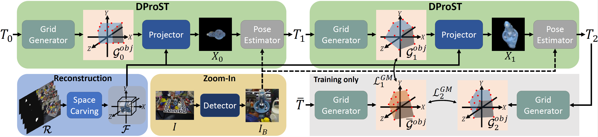
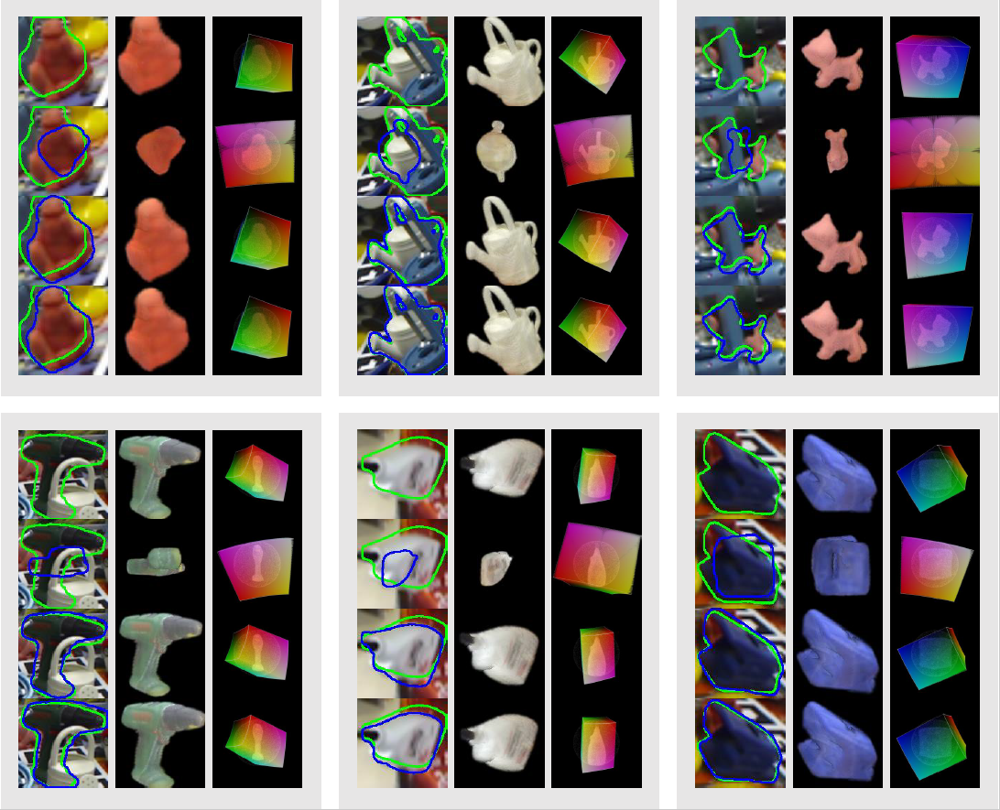
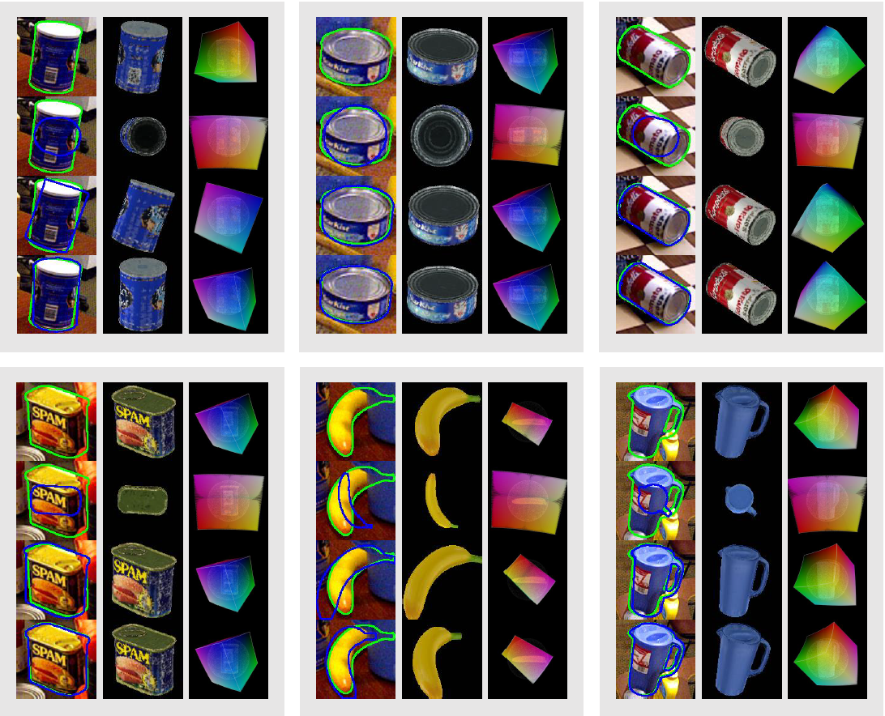

# DProST: Dynamic Projective Spatial Transformer Network
Pytorch implementation of 
"DProST: Dynamic Projective Spatial Transformer Network for 6D Pose Estimation"[ECCV2022]  
DProST is a 6D-object pose estimation method based on grid matching in object space.

[[ArXiv](https://arxiv.org/abs/2112.08775)]

## Overview of DProST

Predicting the object's 6D pose from a single RGB image is a fundamental computer vision task. Generally, the distance between transformed object vertices is employed as an objective function for pose estimation methods. However, projective geometry in the camera space is not considered in those methods and causes performance degradation. In this regard, we propose a new pose estimation system based on a projective grid instead of object vertices. Our pose estimation method, dynamic projective spatial transformer network (DProST), localizes the region of interest grid on the rays in camera space and transforms the grid to object space by estimated pose. The transformed grid is used as both a sampling grid and a new criterion of the estimated pose. Additionally, because DProST does not require object vertices, our method can be used in a mesh-less setting by replacing the mesh with a reconstructed feature. Experimental results show that mesh-less DProST outperforms the state-of-the-art mesh-based methods on the LINEMOD and LINEMOD-OCCLUSION dataset, and shows competitive performance on the YCBV dataset with mesh data. 

## Installation
- Clone this repository:
```
git clone https://github.com/parkjaewoo0611/DProST.git
cd DProST
```
- DProST is based on pytorch 1.7.0, cudatoolkit 11.0, and pytorch3d 0.5.0.
- Check the [CUDA install](https://docs.nvidia.com/cuda/cuda-installation-guide-linux/index.html) for cuda and pytorch version match.
- Create anaconda virtual env, install packages and clone official bop_toolkit by following command.
```
source source_install.sh
```


## Dataset
- Edit the dataset_root in source_download.sh to your own data folder.
- Download the data and make a symbolic link to your dataset folder by
```
./source_download.sh
```
- Preprocessed data params (bboxes, K, indexes...) are in pickle file.
- Dataset structure should look like  
```
Dataset
├──LINEMOD
    ├──dataset_info.md
    ├──train.pickle
    ├──test.pickle
    ├──train_pbr.pickle
    ├──train_syn.pickle
    ├──index
        ├──ape_test.txt
        ...
    ├──models
        ├──models_info.json
        ├──obj_000001.ply
        ...
    ├──pbr
        ├──000000
        ...
    ├──test
        ├──000001
        ...
    ├──test_bboxes
        ├──bbox_faster_all.json
        ├──bbox_yolov3_all.json
    ├──train
        ├──000001
        ...
    ├──syn (optional)
        ├──ape
        ...
    ├──backgrounds (optional)
        ├──2007_000027.jpg
        ...
├──OCCLUSION
├──YCBV
```

- The structure of OCCLUSION and YCBV dataset should be same as LINEMOD.

## Train
- Check the code and model are correctly installed by executing the following toy example command.
```
python train.py --gpu_id 0 --data_dir Dataset/LINEMOD --is_toy true --batch_size 1
```
- For faster training, we updated the [PyTorch DDP](https://pytorch.org/tutorials/intermediate/ddp_tutorial.html) for multi-GPU training (which may show slightly different performance) and [simple-gpu-scheduling](https://pypi.org/project/simple-gpu-scheduler) to easily manage many experiments. 
- Train the DProST as you want
```
Ex)
# LINEMOD ape object on gpu 0
python train.py --gpu_id 0 --data_dir Dataset/LINEMOD --use_mesh false --obj_list 1 --mode train_pbr 

# LINEMOD each object on gpu 0,1,2 (with gpu_scheduling)
simple_gpu_scheduler --gpus 0 1 2 < gpu_commands.txt

# OCCLUSION all objects on gpu 0,1,2 (with DDP)
python train.py --gpu_id 0 1 2 --data_dir Dataset/OCCLUSION --use_mesh false --obj_list 1 5 6 8 9 10 11 12 --mode train_pbr

# train YCBV 002_master_chef_can object with mesh on gpu 0 
python train.py --gpu_id 0 --data_dir Dataset/YCBV --use_mesh true --obj_list 1 --mode train_pbr --epochs 300 --save_period 10 --early_stop 100 -- lr_step_size 200 --valid_metrics ADD_S_AUC
```

## Test 
### Pre-trained Model
- Download pre-trained models [here](https://drive.google.com/drive/folders/16ZtiAQ_579Kd7pmMu8Wz4EB7Urmr8lWt)
- Evaluate and visualize the model with test code
```
Ex)
# evaluate & visualize result
python test.py -r pretrained/LMO_all/all/model/model_best.pth -p pretrained/LMO_all/all/result -v true --gpu_scheduler false --data_dir Dataset/OCCLUSION
-r: Path to pretrained model & config.json.  
-p: Path to save the visualize qualitative results.  
-v: boolean option to visualization.  
--gpu_scheduler: turn off the gpu_scheduler in test.  
```


## Qualitatiave Results
For each gray cell, the first row shows gt, the second row shows the initial pose, and the third and fourth-row show results of the first iteration and second iteration, respectively. Also, the first column shows the contour of the projection, the second column shows the projection of the reference feature, and the third row shows the object space grid. Blue contour shows the predicted pose (or initial pose), and green contour shows the gt pose. 
- Qualitative results on OCCLUSION dataset 


- Qualitative results on YCBV dataset



## Acknowledgements
Our project is based on the following projects. We appreciate the authors for sharing their great code and dataset.
- [bop challenge](https://bop.felk.cvut.cz/home/)
- [pytorch template](https://github.com/victoresque/pytorch-template)
- [cosypose](https://github.com/ylabbe/cosypose)
- [DeepIM](https://github.com/liyi14/mx-DeepIM)
- [ProST](https://github.com/gaocong13/Projective-Spatial-Transformers)
- [GDR-Net](https://github.com/THU-DA-6D-Pose-Group/GDR-Net)
- [pytorch3d](https://pytorch3d.org/)

## Citation
```
@article{park2022dprost,
  title={DProST:Dynamic Projective Spatial Transformer Network for 6D Pose Estimation},
  author={Park, Jaewoo and Cho, Nam Ik},
  booktitle={ECCV},
  year={2022}
}
```
